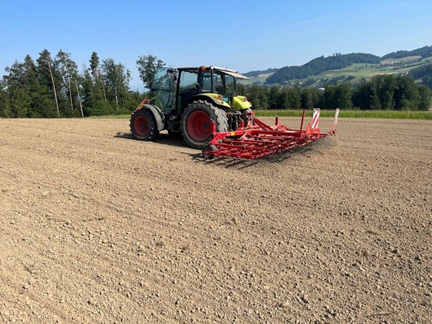
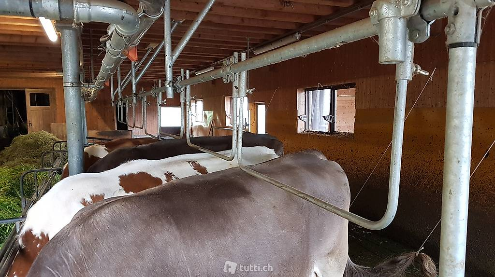
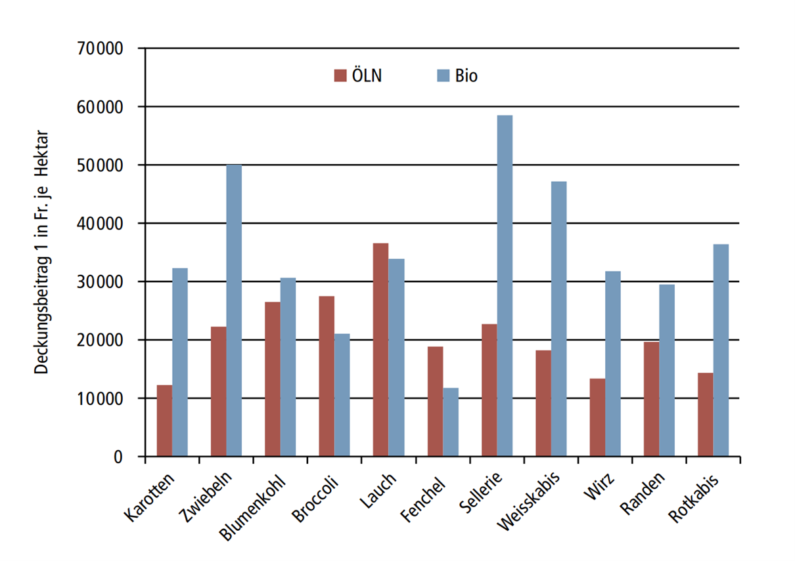

+++
title = "Biolandbau: Der Weg zur Nachhaltigkeit"
date = "2024-06-18"
draft = false
pinned = false
image = "image-1-.jpg"
+++
<!--StartFragment-->


Biolandbau verzichtet auf chemische Pestizide und fördert die Bodenfruchtbarkeit. Diese nachhaltige Methode liefert gesunde Lebensmittel und schont die Umwelt.


Er hat bereits vor drei Jahren den Umstieg auf Bio gewagt: Heute verwendet er keine Herbizide auf seinen Feldern, lässt seinen Kühen regelmässig ihren Auslauf und setzt auf natürliche Schädlingsbekämpfung – etwas, das im konventionellen Landbau überhaupt nicht vorkommt.

Es ist Viertel nach fünf. Alex Wüthrich steht schon auf und geht seine Tiere füttern. Er melkt seine Kühe und mistet anschliessend aus. Frühmorgens hat er schon über zwei Stunden gearbeitet und er macht eine Frühstückspause. Daraufhin geht er aufs Feld und muss sich um alles kümmern, was anfällt. Als Biobauer ist seine Arbeit sehr vielfältig: Im Frühling fängt Alex um zehn Uhr mit der Arbeit an, damit er seine Tiere möglichst früh auf die Wiesen lassen kann. Im Winter bereitet er Brennholz, Nutzholz oder Bauholz vor, je nachdem, was gerade gefragt ist. Er selbst heizt ebenfalls viel mit Brennholz, also erneuerbarer Energie. Er beginnt damit, die Ackerflächen zu striegeln, damit das Unkraut bedeckt oder herausgerissen wird. Alex erzählt, dass diese Aufgaben auch stark vom Wetter abhängen: Bei Regen tätigt er Umbauarbeiten im Inneren, repariert Anfälliges oder kann sich mit Maschinenservice beschäftigen. Wenn das Wetter jedoch angenehm ist, ist Wüthrich draussen auf dem Feld, entweder im Frühling dabei zu striegeln oder im Hochsommer dabei das Getreide zu dreschen. Er hat besonders den Aspekt der Arbeit hervorgehoben, dass es äusserst abwechslungsreich ist, da man bei jeder Jahreszeit und bei jedem Wetter anders beschäftigt ist. Die einzige Ausnahme bildet die Stallarbeit, welche unter allen Bedingungen gleich bleibt.

### Der Weg zur Knospe


Bio Suisse wurde 1981 gegründet, um den biologischen Landbau in der Schweiz zu fördern. Die Bewegung begann als Antwort auf die zunehmende Industrialisierung der Landwirtschaft. Heute gibt es über 7.000 Bauernhöfe und Gärtnereien, die nach den strengen Richtlinien von Bio Suisse arbeiten. Seit 1993 ist das Bio-Suisse-Label, auch bekannt als die "Knospe", auf dem Markt präsent und dient als Qualitätssiegel für Konsumenten*innen. Die Knospe steht für hohe Standards in Bezug auf Tierwohl, Biodiversität und Umweltschutz. Alle Schritte vom Feld bis zum Verkaufsregal unterliegen strengen Kontrollen, auch Alex Wüthrich muss sich dranhalten.



## Ablauf des Prozesses

Der 43-jährige Alex Wüthrich lebt zusammen mit Frau und Vater und seinen zwei Kindern auf seinem Betrieb im Gümligental. Er ist seit 27 Jahren Bauer; als er 16 war, galt er offiziell als Bauer. Zu Beginn seiner Laufbahn war er auswärts als Bauer aktiv. Nach einigen Jahren kehrte er wieder ins Gümligental zurück zum Betrieb seines Vaters, um ihn zu unterstützen. 2016 übernahm er mittels Kaufvertrags den Betrieb seines Vaters und vier Jahre später beschloss er, den Umstieg auf Bio zu wagen.

Die hügelige und extensive Landschaft der Umgebung machte intensive Landwirtschaft schwierig, was einer der Gründe für den Umstieg war. Als er seine Masterprüfung abschloss, wog er die Vor- und Nachteile der Biolandwirtschaft ab. Zum Beispiel berücksichtigte er den Mehraufwand und die Notwendigkeit, resistentere Kulturen zu wählen, wie eine widerstandsfähigere Getreidesorte. Ein Vorteil war für ihn der staatliche Erlös. Für Wüthrich war es auch eine ethische Frage. Er wollte nachhaltig produzieren, den Boden gesund erhalten, um somit einen geschlossenen Kreislauf auf seinem Betrieb zu schaffen. Anfang 2021 wurde der Betrieb als Umstellungsbetrieb anerkannt und seit dem 1. Januar 2023 ist er offiziell ein Biobetrieb.

Für Wüthrich ist die Umstellung «keine grosse Sache» gewesen, da er schon zuvor nicht sehr intensiv und teilweise sogar ganz herbizidfrei gearbeitet hat. Der Boden hat sich deshalb nicht wirklich verändern müssen. So reibungslos läuft der Umstellungsprozess allerdings nicht bei allen Betrieben. Bei Betrieben, welche sehr intensiv gearbeitet haben und nun auf Bio wechseln wollen, gibt es manchmal nach zwei bis drei Jahren ein Problem und die Beträge sinken.

Bei der Umstellung hat Wüthrich für die Kühe die grössten Veränderungen vornehmen müssen. Momentan hat er immer noch einen Anbindestall, dort hat er aber seinen Kuhtrainer ersetzt. Dieser sorgt dafür, dass die Kühe nicht die ganze Zeit im Dreck liegen. Er hat den Kuhtrainer durch mechanische Metallrohre ausgetauscht, was weniger effizient ist und dazu führt, dass Wüthrich seit dem Umstieg viel mehr misten muss. Er macht drei- bis fünfmal am Tag den Stall frisch.

Vorschrift ist, dass sie im Winter mindestens 13-mal im Monat auf den Laufhof dürfen und mindestens 22-mal im Sommer. Dies wird auch kontrolliert. Wüthrich notiert, wann er die Kühe hinauslässt in seinem Auslaufjournal. Insgesamt führt er zwei Journale, das zweite Journal ist das Arzneimitteljournal.

Wenn die Kühe krank werden, darf Wüthrich immer noch Antibiotika verwenden, denn «das Tierwohl kommt immer noch vor dem Label». Verändert hat sich dort, dass er Antibiotika gezielt auf den Krankheitserreger einsetzen muss und er nicht mehr Breitbandantibiotika verwenden darf. Um die passenden Antibiotika zu finden, lässt er die Milch auf Erreger prüfen.

Kontrolliert werden diese Journale einmal im Jahr bei einer Vollbiokontrolle von der Bioinspekta. Dort würden nicht nur die Journale kontrolliert, sondern auch Bilanzen, wie zum Beispiel die Nährstoffbilanz. Um aber Betrug zu verhindern, gibt es Kontrollen, auf die man sich nicht vorbereiten kann. Zum Beispiel war seine letzte Kontrolle eine Tierschutzkontrolle im letzten Winter.

Für das Futter seiner Tiere ist Wüthrich selbst verantwortlich, er darf aber fünf Prozent Kraftfutter verwenden. Er bewirtschaftet für das Futter und auch zum Verkauf Kulturen wie Getreide, Weizen, Hafer, Urdinkel, Mais und Leguminose. Das Futter besteht grösstenteils aus Gras, welches er entweder auf dem Heustock im Trockenen deponiert oder in Silos konserviert. Sobald er die gewünschte Milchsäuregärung hat, lagert er die Grassilage als Ballen im Trockenen. Er muss besonders aufpassen, dass die Ballen keine Löcher haben, um eine Fehlgärung zu vermeiden. Den Mais verarbeitet er teilweise auch zu Silage. Er wird ebenfalls mit Milchsäurebakterien konserviert, um eine ansprechende Gärung zu erhalten. Das Futter, welches Wüthrich seinen Kühen füttert, besteht daher hauptsächlich aus Gras, Silage, Mais und Heu und zusätzlich noch fünf Prozent Kraftfutter.

Wüthrich meint, er hätte den Schritt auf Bio schon viel früher machen sollen. Seine Eltern hätten nicht auf Biolandwirtschaft umsteigen wollen. Er mag seine Arbeit als Biolandwirt sehr, ihm gefällt die Vielfalt. Es störe ihn auch nicht, dass er das ganze Jahr auf seinem Betrieb lebt, «es ist halt mein Ding».

### Unterstützung vom Staat


Als Biobauer oder Biobäuerin erhält man staatliche Unterstützung, um den Biobetrieb zu erhalten. In der Schweiz sind die Lebensmittel beziehungsweise die Produktionskosten so hoch, dass der staatliche Erlös nicht alles abdeckt. Ohne zusätzliche Fördergelder könnte man als Landwirt*in in der Schweiz gar nicht existieren. Die Fördergelder sind da, um die vielen unbezahlten Arbeitsstunden zu entschädigen. Wüthrich macht pro Stunde ungefähr 18 Franken, es gibt demnach nicht einfach unglaublich viel Geld vom Staat. Wüthrich hätte sonst längst einen neuen Stall gebaut.



Während des ganzen Umstellungsprozesses hatte Wüthrich Unterstützung, um ihm die Umstellung zu vereinfachen. Bioberater Niklaus Sommer unterstützt Landwirte\*innen wie Alex Wüthrich bei der Umstellung und bietet Kurse an. Er findet Biolandwirtschaft eine spannende Thematik und Bewirtschaftungsform, da diese nachhaltig wäre. Er möchte gerne andere Landwirte\*innen in die Biolandwirtschaft einführen und unterstützt diese gerne während des ganzen Prozesses. An der Biolandwirtschaft mag Sommer, dass die Produkte der Bioindustrie qualitativ gut und gesund wären, da keine chemisch synthetischen Düngemittel verwendet werden. Ihn stört es nicht, dass die Produktivität geringer als im Konventionellen ist, denn für ihn gilt Qualität über Quantität. Wie er so schön sagt: «Ich mag es zwar auch in den McDonald's zu gehen, aber nach einem McDonald's Menü hat man einfach nach zwei Stunden wieder Hunger. Dies zeigt auch auf, dass nicht die Quantität relevant ist, sondern die Qualität».

In der Schweiz ist der Selbstversorgungsgrad unter 60%, wenn man auf Biolandwirtschaft umsteigt, sinkt dieser. Für Sommer ist das Problem nicht die Produktivität, sondern eher der Foodwaste. Der Selbstversorgungsgrad wäre nicht so tief, wenn man als einzelner Bürger nicht so viel Essen aufgrund der Qualitätsnormen oder bei der Verarbeitung wegwerfen würde. Bei der Bioproduktion gehen jedoch auch viele Produkte kaputt. Zum Beispiel wenn der Weizen von einem Schädling befallen ist, könne man nicht wirklich viel machen. Dies führt teilweise zu grossen Ertragsverlusten und ist für Wüthrich wie Foodwaste.

Als Berater hat Sommer schon mit Landwirten*innen zu tun gehabt, die zurück in die konventionelle Landwirtschaft oder zu IP-Suisse wechseln wollten. Das liegt manchmal an einem familiären Konflikt, beispielsweise «Der Seniorbauer, welcher noch daran gewöhnt ist, dass er die Brennnesseln bespritzt, darf dann eben nicht mehr. Das gibt dann Spannungen in der Familie.» Häufig liegt es auch an Richtlinienverschärfungen, dass man beispielsweise für das Futter der Milchtiere nur noch fünf statt zehn Prozent Kraftfutter verwenden darf.

## Ist der Umstieg jetzt sinnvoll?

Zunächst hat man in der Biolandwirtschaft merklich mehr Arbeitsstunden als im konventionellen Betrieb: Wüthrich hätte einen Mehraufwand von 500 bis 600 Zusatzstunden pro Jahr. Im Biolandbau dürfen weder Pestizide, Herbizide noch chemisch synthetische Dünger benutzt werden, die Unkrautbekämpfung muss mechanisch ablaufen, weshalb man mehr Zeit aufwenden muss. Für die mechanische Unkrautbekämpfung wird der Hackstriegel verwendet. Dieser kehrt die Erde mitsamt Unkraut mit langen Metalldrähten um und zerstört so das Unkraut. Das Problem am Hackstriegel: Er ist ineffektiver gegen Pilze und Schädlinge. Auch bei den Tieren gibt es einen grossen Mehraufwand: Das Frischmachen des Stalls ist häufiger gefragt, da man anders mit den Tieren umgehen muss. Man darf zum Beispiel keinen elektrischen Kuhtrainer mehr benutzen. Dafür erhält man einen Erlös, welcher Bauern und Bäuerinnen wie Wüthrich in die Biolandwirtschaft lockt. In einem guten Jahr verdient man als Biobauer oder Biobäuerin mehr als ein konventioneller Bauer oder Bäuerin.

Ebenfalls ein entscheidender Punkt ist der Standort des Bauernhofs. Beispielsweise ist der Boden im Seeland ideal für die Gemüseproduktion, wo eine intensive Kultivierung am lukrativsten ist. In eher hügeligen Gebieten sind hingegen Tiere besser geeignet, da eine intensive Kultivierung dort weniger geeignet ist. Das Gemüse hat teilweise einen geringen Deckungsbeitrag, welcher nicht wirklich lohnend für einen Biolandwirt ist. Der Deckungsbeitrag ist der Erlös, welchen man vom Staat bekommt. Im Biolandbau ist der Deckungsbeitrag nicht bei allen Kulturen gleich.

Ein zusätzlicher Faktor ist Schatten, welcher nicht ideal für Getreide ist, dafür aber Hackfrüchten wie Kartoffeln und Mais eine gute Umgebung bietet. Kartoffeln sind eine eher schwierige Kultur, da diese sehr anfällig auf Schädlinge sind.  In der Biolandwirtschaft kann man nicht viel dagegen machen. Die Bodenbeschaffenheit, also ob man einen lehmigen oder einen sandigen Boden hat, spielt auch eine grosse Rolle. Je nach Kultur sind feuchtere oder trockenere Böden beliebter für den Anbau. Je nach Boden sind verschiedene Kulturen besser geeignet, bei denen eine biolandwirtschaftliche Kultivierung nicht immer lukrativ und leicht ist, wie eben im Seeland, wo eine intensive Kultivierung teilweise den grössten Profit bringt. Bei Tierbauernhöfen kann es sein, dass der Stall nicht für Biolandwirtschaft geeignet ist oder dass dieser nicht optimal ist. In dem Fall muss man den Stall umbauen und den Vorschriften anpassen, wie Wüthrich dies tun musste.

Ein weiterer guter Aspekt der Biolandwirtschaft ist, dass man einen Kreislauf pflegt. Man macht von den Pflanzen bis zu den Tieren alles selbst und hat viel Biodiversität. Ausserdem sei man beliebter als Biolandwirt*in. Man sei nicht mehr der Buhmann und werde nicht auf der Strasse angehupt. Es herrscht also auch ein gewisser sozialer Druck.  Im Grossen und Ganzen sei es jedoch wichtig, dass der jeweilige Bauer oder die jeweilige Bäuerin die Vor- und Nachteile selbst abwägt.

Sommer gibt noch ein paar wichtige Ratschläge für Landwirte\*innen, welche sich über den Umstieg Gedanken machen: «Es ist wichtig, dass man sich an einen langjährigen Bauern wendet, um von dessen Erfahrung zu profitieren». Man solle sich sicher auch mit anderen Bauern und Bäuerinnen regelmässig treffen, um zusammen über wichtige Themen und Herausforderungen zu sprechen. Kurse zu der Biolandwirtschaft könne man sicher auch besuchen und Bioberater\*innen wie Niklaus Sommer beantworten gerne auch Fragen. Der wahrscheinlich wichtigste Punkt der Biolandwirtschaft sei, dass der Landwirt*in wirklich umstellen will.

<!--EndFragment-->